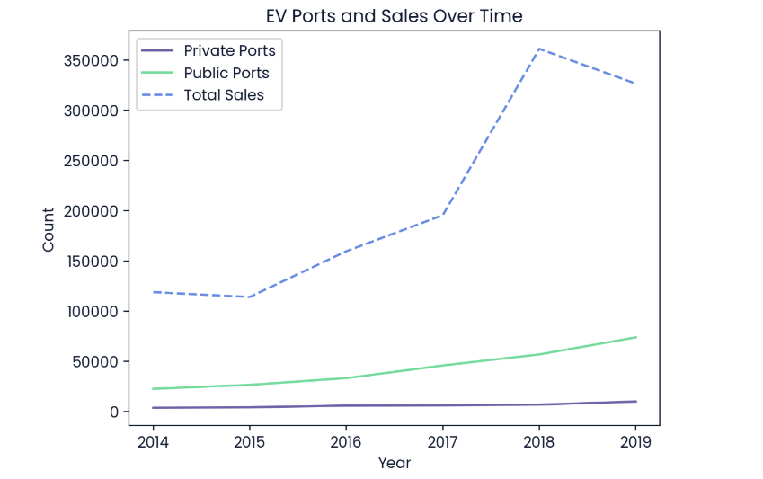

# EV Charging Ports and Sales Trend Analysis

This repository provides an analysis of trends in the number of electric vehicle (EV) charging ports and vehicle sales from 2015 to 2018, using data from the US Government's Alternative Fuels Data Center and other sources. The analysis explores the relationship between electric vehicle sales and the growth of both public and private charging ports.

## Objectives
1. The goal of this project is to answer the question: Does increased electric vehicle sales lead to **more** public or private charging ports?
2. We will also explore trends between the number of charging ports (both public and private) and EV sales between **2015** and **2018**.

## Dataset Description
- **private_ev_charging.csv** - Contains data on **private** EV charging ports and station locations by year.
- **public_ev_charging.csv** - Contains data on **public** EV charging ports and station locations by year.
- **ev_sales.csv** - Contains sales data of electric vehicles by year.

## Installation
Clone this repository and install the necessary libraries if required:
```bash
git clone https://github.com/JReaves10/EVChargingTrends
cd EVChargingTrends
```

## Code Explanation
### 1. Importing Data
Load the datasets using pandas.read_csv() containing EV sales and charging ports information.


### 2. Merging Data
The three datasets are merged using the year variable to align the data. We ensure only complete rows are kept for analysis.


### 3. Total EV Sales in 2018
The number of electric vehicles sold in 2018 is stored in the variable ev_sales_2018.


### Integration
Total sales is merged with the filtered charging port information and rows with missing sales data are removed


### 4. Trends Visualization
The trends of private ports, public ports, and total sales are plotted on a line graph to visualize their changes over time.


### 5. Trend Comparison
A comparison of trends between EV sales and charging ports from 2015 to 2018 reveals whether vehicle sales and port installations (both public and private) followed the same trend. The result is stored in the variable trend.


## Results
The number of electric vehicle sales in 2018 is 361,315. After comparing the trends, we observe that the trends for EV sales and the number of charging ports (both public and private) between 2015 and 2018 are the same.



## Conclusion
The analysis suggests that the growth in electric vehicle sales is closely linked to the expansion of both public and private charging infrastructure.
